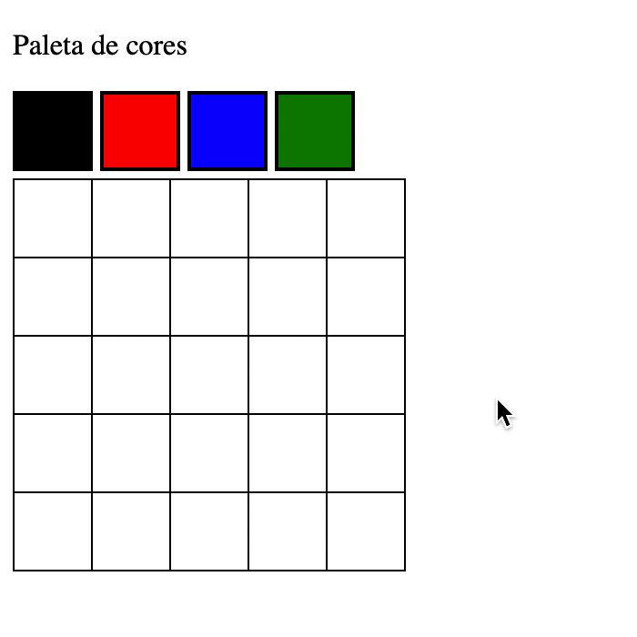

# project-pixels-art

## Boas vindas ao projeto Arte com Pixels!

## Sumário

- [Habilidades](#habilidades)
- [Desafio](#desafio)
- [Instruções](#instruções)
  - [Linter](#linter)
  - [Cypress](#cypress)
- [Tecnologias Utilizadas](#tecnologias-utilizadas)
- [Status](#status)
- [Desempenho](#desempenho)
- [Colaborador](#colaborador)
- [Observações](#observações)
- [Requisitos](#requisitos)


## Habilidades

- Manipular o DOM / Manipular o Javascript
  - Nesse projeto aplicamos de forma prática a manipulação do DOM e do Javascript

## Desafio

- O desafio era implementar uma página web que contém uma paleta de cores funcional que pudesse ser utilizada para criar desenhos em pixels.
- Para esse desafio, foi utilizado `javascript`, `css` e `html`.

## Instruções

1. Clonar o repositório:
  * `git clone git@github.com:walacenascimento/project-pixels-art.git`.

2. Instalando as dependências:
  * `npm install`

3. Rondando o projeto:
  * Para rodar o projeto no navegador foi utilizado a extensão `Code Runner` do `VSCode`

## Linter

Neste projeto, foi utilizar os linters `ESLint` e `StyleLint`, com o objetivo de garantir a qualidade do código, assim como
alinhar-se com as boas práticas de desenvolvimento.
Para rodá-los localmente no projeto, execute os comandos abaixo:

```bash
npm run lint
npm run lint:styles
```

Executado o comando `npm run lint:styles`, irá avaliar se os arquivos com a extensão `CSS` estão com o padrão correto.

Executado o comando `npm run lint`, irá avaliar se os arquivos com a extensão `JS` e `JSX` estão com o padrão correto.

## Cypress

Cypress é uma ferramenta de teste de front-end desenvolvida para a web.

Para executar os testes apenas no terminal:

```bash
npm test
```

Para executar os testes e vê-los rodando em uma janela de navegador:

```bash
npm run cypress:open
```

***ou***

```bash
npx cypress open
```
Após executar um dos dois comandos acima, será aberta uma janela de navegador, então basta clicar no nome do arquivo de teste que quiser executar
ou para executar todos os testes clique em Run all specs

**Para rodar o cypress é preciso ter rodado o comando npm install anteriormente.**

 ### Tecnologias Utilizadas:
1. `JavaScript`

### Status:
 - `Finalizado` - `APROVADO`

### Desempenho:
  * `95%`

### Colaborador:
* Colaborador(es,as)
    * Este projeto foi desenvolvido individualmente por mim, `Walace Nascimento`

### Observações:
- Tanto os linters quanto o cypress, foram configurados pela <a href="https://betrybe.com">`Trybe`</a>
- Todos os teste desse projeto foram implementandos pela <a href="https://betrybe.com">`Trybe`</a>
- O exemplo do projeto depois de pronto, foi fornecido pela <a href="https://betrybe.com">`Trybe`</a>

## Requisitos:
`Requisitos obrigatórios:`
- [x] 1. Adicione à página o título "Paleta de Cores"
  - O título deverá ficar dentro de uma tag `h1` com o `id` denominado `title`;
  - O texto do título deve ser **exatamente** "Paleta de Cores".

- [x] 2. Adicione à página uma paleta de quatro cores distintas.
  - A paleta de cores deve ser um elemento com `id` denominado `color-palette`, ao passo que cada cor individual da paleta de cores deve possuir a `classe` `color`;
  - A cor de fundo de cada elemento da paleta deverá ser a cor que o elemento representa. **A única cor não permitida na paleta é a cor branca.**;
  - Cada elemento da paleta de cores deverá ter uma borda preta, sólida e com 1 pixel de largura;
  - A paleta de cores deverá listar todas as cores disponíveis para utilização lado a lado, e deverá ser posicionada abaixo do título "Paleta de Cores";
  - A paleta de cores não deve conter cores repetidas.

- [x] 3. Adicione a cor **preta** como a primeira cor da paleta de cores.

- [x] 4. Adicione à página um quadro de pixels, com 25 pixels.
  - O quadro de "pixels" deve ter 5 elementos de largura e 5 elementos de comprimento;
  - O quadro de "pixels" deve possuir o `id` denominado `pixel-board`, ao passo que cada "pixel" individual dentro do quadro deve possuir a `classe` denominada `pixel`;
  - A cor inicial dos "pixels" dentro do quadro, ao abrir a página, deve ser branca;
  -  O quadro de "pixels" deve aparecer abaixo da paleta de cores.

- [x] 5. Faça com que cada elemento do quadro de pixels possua 40 pixels de largura, 40 pixels de altura e seja delimitado por uma borda preta de 1 pixel.

- [x] 6. Defina a cor preta como cor inicial. Ao carregar a página, a cor preta já deve estar selecionada para pintar os pixels
  - O elemento da cor preta deve possuir, inicialmente, a `classe` `selected`;
  - Note que o elemento que deverá receber a classe `selected` deve ser um dos elementos que possuem a classe `color`, como especificado no **requisito 2**.

- [x] 7. Clicar em uma das cores da paleta faz com que ela seja selecionada e utilizada para preencher os pixels no quadro.
  - A `classe` `selected` deve ser adicionada à cor selecionada na paleta, ao mesmo tempo em que é removida da cor anteriormente selecionada;
  - Somente uma das cores da paleta deve ter a `classe` `selected` de cada vez;
  - Note que os elementos que deverão receber a classe `selected` devem ser os mesmos elementos que possuem a classe `color`, como especificado no **requisito 2**.

- [x] 8. Clicar em um pixel dentro do quadro após selecionar uma cor na paleta faz com que o pixel seja preenchido com a cor selecionada.

- [x] 9. Crie um botão que, ao ser clicado, limpa o quadro preenchendo a cor de todos seus pixels com branco.


`Requisitos Bônus`
- [ ] 10. Faça o quadro de pixels ter seu tamanho definido pela pessoa usuária.
  - Crie um input e um botão que permitam definir um quadro de pixels com tamanho entre 5 e 50. Ao clicar no botão, deve ser gerado um quadro de **N** pixels de largura e **N** pixels de altura, onde **N** é o número inserido no input;
 - Ou seja, se o valor passado para o input for 7, ao clicar no botão, vai ser gerado um quadro de 49 pixels (7 pixels de largura x 7 pixels de altura);
- O input deve ter o `id` denominado `board-size` e o botão deve ter o `id` denominado `generate-board`;
- O input só deve aceitar número maiores que zero. Essa restrição **deve** ser feita usando os atributos do elemento `input`;
- O botão deve conter o texto "VQV";
- O input deve estar posicionado entre a paleta de cores e o quadro de pixels;
- O botão deve estar posicionado ao lado do input;
- Se nenhum valor for colocado no input ao clicar no botão, mostre um `alert` com o texto: "Board inválido!";
- O novo quadro deve ter todos os pixels preenchidos com a cor branca.


- [ ] 11. Limite o tamanho mínimo e máximo do board.
  - Caso o valor digitado no input `board-size` fuja do intervalo de 5 a 50, faça:
    - Valor menor que 5, considerar 5 como padrão;
    - Valor maior que 50, considerar 50 como padrão.

- [ ] 12. Faça com que as cores da paleta sejam geradas aleatoriamente ao carregar a página.
  - A cor preta ainda precisa estar presente e deve ser a primeira na sua paleta de cores.


### Exemplo do projeto depois de pronto:


