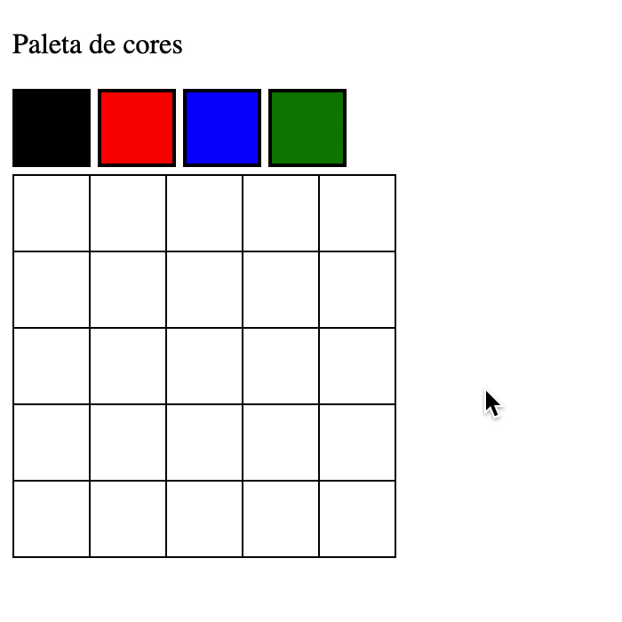

# project-pixels-art

## Boas vindas ao projeto Arte com Pixels!

## Sumário

- [Habilidades](#habilidades)
- [Desafio](#desafio)
- [Como desenvolver](#como-desenvolver)
  - [Linter](#linter)
  - [Cypress](#cypress)

## Habilidades

- Manipular o DOM / Manipular o Javascript
  - Nesse projeto aplicamos de forma prática a manipulação do DOM e do Javascript

## Desafio

- O desafio era implementar uma página web que contém uma paleta de cores funcional que pudesse ser utilizada para criar desenhos em pixels.
- Para esse desafio, foi utilizado `javascript`, `css` e `html`.

## Como desenvolver
## Instruções:

1. Clonar o repositório:
  * `git clone git@github.com:walacenascimento/project-pixels-art.git`.

2. Instalando as dependências:
  * `npm install`

3. Rondando o projeto:
  * Para rodar o projeto no navegador foi utilizado a extensão `Code Runner` do `VSCode`
  
## Linter

Neste projeto, foi utilizar os linters `ESLint` e `StyleLint`, com o objetivo de garantir a qualidade do código, assim como
alinhar-se com as boas práticas de desenvolvimento.
Para rodá-los localmente no projeto, execute os comandos abaixo:

```bash
npm run lint
npm run lint:styles
```

Executado o comando `npm run lint:styles`, irá avaliar se os arquivos com a extensão `CSS` estão com o padrão correto.

Executado o comando `npm run lint`, irá avaliar se os arquivos com a extensão `JS` e `JSX` estão com o padrão correto.

## Cypress

Cypress é uma ferramenta de teste de front-end desenvolvida para a web.

Para executar os testes apenas no terminal:

```bash
npm test
```

Para executar os testes e vê-los rodando em uma janela de navegador:

```bash
npm run cypress:open
```

***ou***

```bash
npx cypress open
```
Após executar um dos dois comandos acima, será aberta uma janela de navegador, então basta clicar no nome do arquivo de teste que quiser executar
ou para executar todos os testes clique em Run all specs

Você também pode assistir a [este](https://vimeo.com/539240375/a116a166b9) vídeo 😉🎙

**Para rodar o cypress é preciso ter rodado o comando npm install anteriormente.**

### OBS:
- Tanto os linters quanto o cypress, foram configurados pela <a href="https://betrybe.com">`Trybe`</a>
- Todos os teste desse projeto foram implementandos pela <a href="https://betrybe.com">`Trybe`</a>
- O exemplo do projeto depois de pronto, foi fornecido pela <a href="https://betrybe.com">`Trybe`</a>

### Exemplo do projeto depois de pronto:


